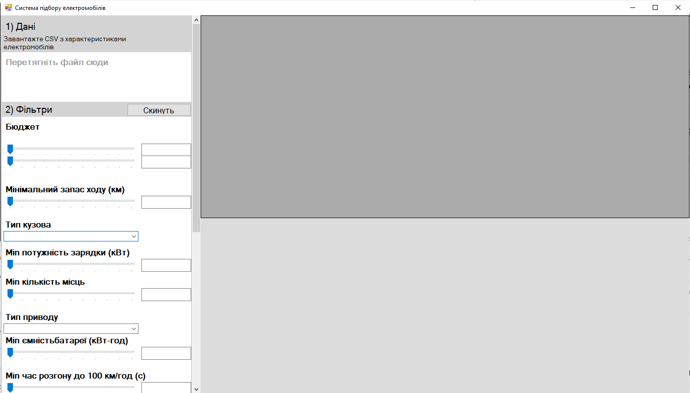
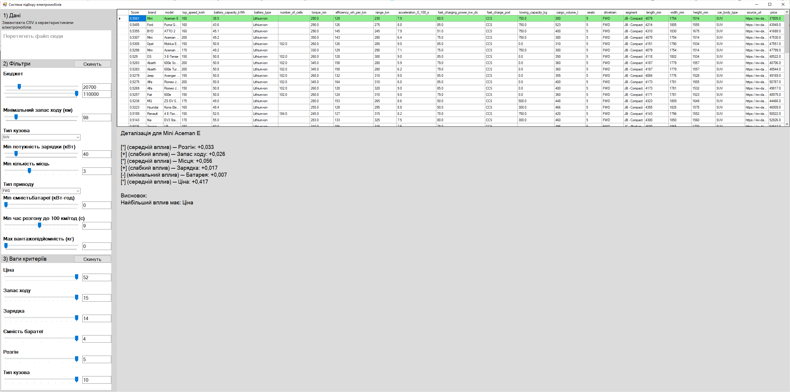

# EV-Selection-DSS-CPP

Інтелектуальна система підбору електромобілів для клієнтів автосалону  
**Реалізація на C++ (Windows Forms + C++/CLI)**

## Про проект

Настільна Windows-застосунок, розроблений у рамках кваліфікаційної роботи магістра.  
Система здійснює багатокритеріальний підбір електромобілів за методом **Weighted Sum Model (WSM)** з можливістю налаштування фільтрів і ваг критеріїв у реальному часі.

### Основний функціонал
- Завантаження даних з CSV-файлу (drag & drop або через діалог)
- Інтерактивні фільтри за бюджетом, запасом ходу, потужністю зарядки, розгоном, кількістю місць тощо
- Налаштування вагових коефіцієнтів критеріїв
- Автоматичний розрахунок рейтингу моделей (Score)
- Пояснення рекомендацій (explainability) при виборі конкретної моделі

## Файли в репозиторії

- `122_Krupka_Nazar_Serhiyovych_it2026.doc` — текст кваліфікаційної роботи
- `EV_Selection_DSS_CPP.zip` — повний вихідний код Visual Studio проекту
- `EV_Selection_DSS_CPP_Executable.zip` — готова до запуску програма (.exe)
- `electric_vehicles_spec_2025.csv` — приклад набору даних
- `screenshots/` — скріншоти інтерфейсу системи

## Скріншоти інтерфейсу

**Головне вікно системи**

**Таблиця рекомендацій та пояснення рішення**

## Як користуватися

1. Розпакуйте `EV_Selection_DSS_CPP_Executable.zip`.
2. Запустіть файл `EV_Selection_DSS_CPP.exe`.
3. Перетягніть файл `electric_vehicles_spec_2025.csv` у ліву панель або скористайтеся областю для завантаження.
4. Налаштуйте фільтри та ваги критеріїв.
5. Натисніть на рядок у таблиці, щоб побачити детальне пояснення рекомендації.

## Автор

**Крупка Назар Сергійович**  
Магістр спеціальності 122 «Комп’ютерні науки»  
Національний університет харчових технологій (НУХТ), Київ, 2026

---

Розроблено в рамках магістерської кваліфікаційної роботи.
